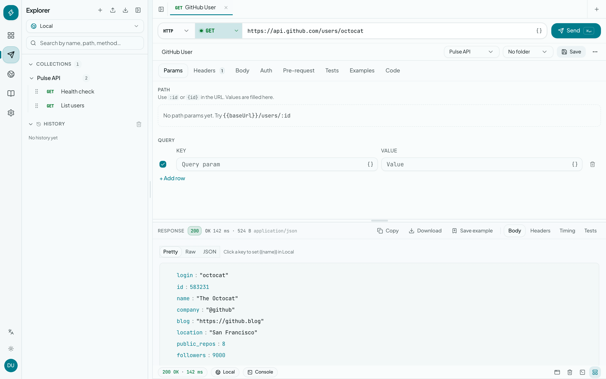
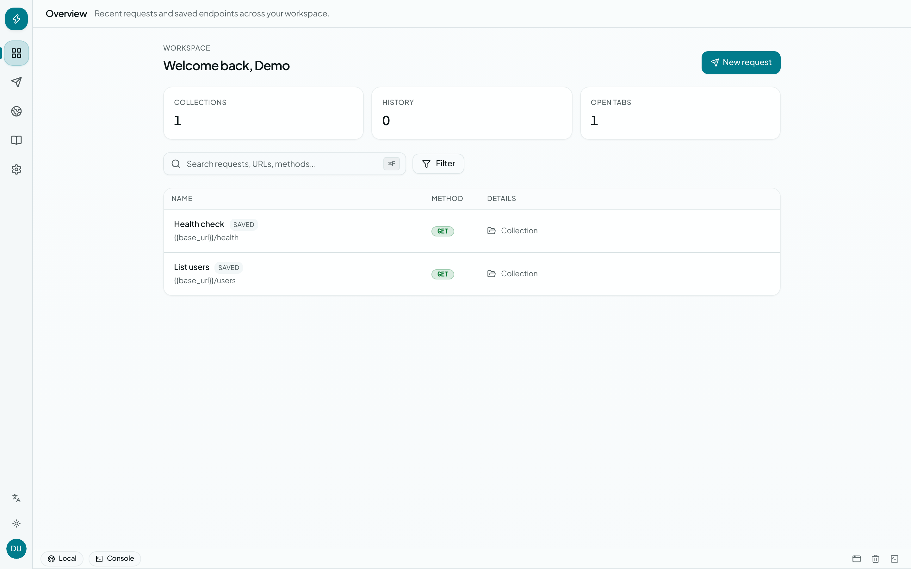
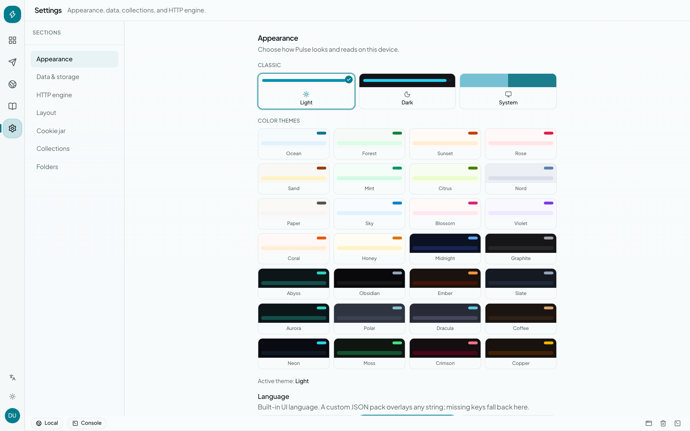
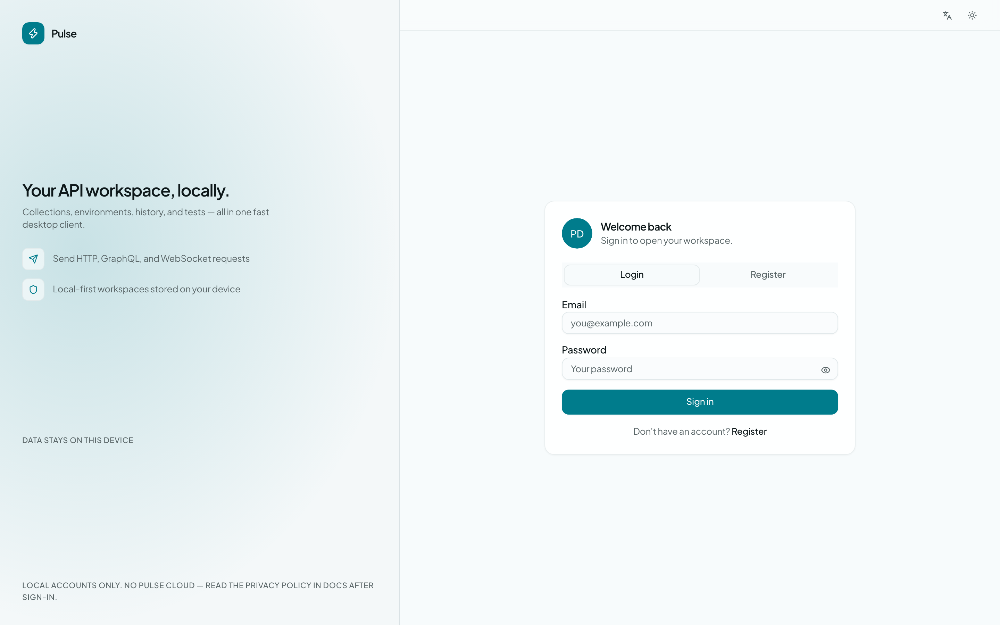

# Pulse API Client

Desktop API client built with **Tauri**, **React**, **TypeScript**, **Tailwind CSS**, **shadcn/ui**, and **Rust** (reqwest).



## Stack

- UI: React + Tailwind CSS v4 + shadcn/ui (Linear-inspired layout)
- State: XState 5 + @xstate/react
- Desktop: Tauri 2
- HTTP: Rust reqwest
- Storage: SQLite per user (workspace, history, cache)

## Features

See the full guide in [docs/FEATURES.md](./docs/FEATURES.md) (also available in-app under **Docs** in the left rail).

- HTTP methods: GET, POST, PUT, PATCH, DELETE, HEAD, OPTIONS, QUERY
- Query params, headers, body (none, JSON, raw, form-urlencoded, multipart)
- Auth: Bearer, Basic, API key, OAuth 2.0 (client credentials + authorization code / PKCE)
- Pre-request scripts with `pulse.environment.set` for collection chaining
- Response panel: status, timing, size, body (JSON pretty-print), headers; preview for images, PDF, Excel/CSV + download
- Collections: save, duplicate, delete, import/export JSON, Postman, Bruno, Insomnia & OpenAPI
- Environments with `{{variable}}` substitution
- Request history in SQLite with search and pagination
- Cookie jar editor (add / edit / delete)
- Custom themes + optional custom CSS overlay
- WebSocket client, collection runner, fuzzy search
- In-app **Docs** covering every feature
- Keyboard shortcuts: **Cmd/Ctrl + Enter** send, **T** new tab, **W** close tab, **L** focus URL, **F** search, **B** explorer

## Screenshots

| Overview | Request workspace |
| --- | --- |
|  |  |

| Settings & themes | Sign in |
| --- | --- |
|  |  |

## Run

```bash
cd api-client
bun install
bun run tauri dev
```

## Build

```bash
bun run tauri build
```

## Regenerate README screenshots

```bash
bun install
bunx playwright install chromium
bun run screenshots:readme
```

## Project layout

- `src/` — React UI
- `src/__tests__/` — Vitest unit tests
- `src/machines/` — XState app machine + `useApp` hook
- `src-tauri/src/http.rs` — HTTP engine (reqwest)
- `src-tauri/src/history.rs` — SQLite request history
- `src-tauri/src/lib.rs` — Tauri commands
- `docs/screenshots/` — README screenshots
- `docs/FEATURES.md` — feature guide (synced with in-app Docs)
- `examples/pulse-theme-override.example.css` — sample custom CSS (all theme tokens + UI hooks)

## Custom theme CSS

Settings → Appearance → Custom CSS can overlay any built-in theme.

1. Use **Snippets** / **CSS variables** / **Component hooks** for quick edits
2. Optionally enable **Live preview** while typing
3. Click **Apply CSS** to persist (or **Export** a `.css` file)
4. **Full example** loads `examples/pulse-theme-override.example.css`

The example covers surfaces, chrome (sidebar/rail/topbar/console), status + method colors, fonts/radius, per-theme `html[data-theme="…"]` scopes, and component classes.
